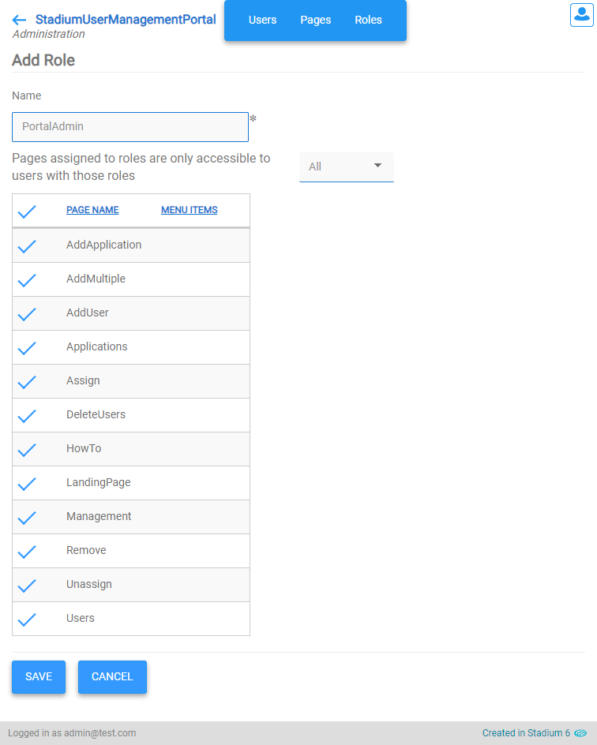
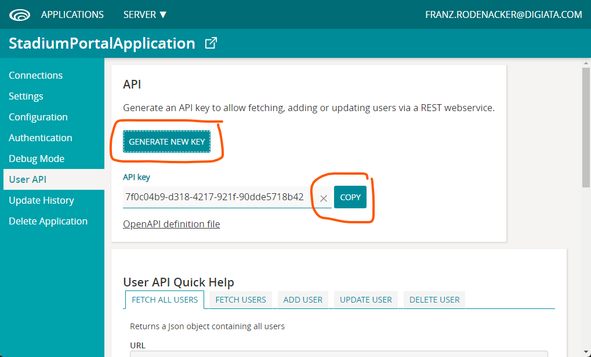
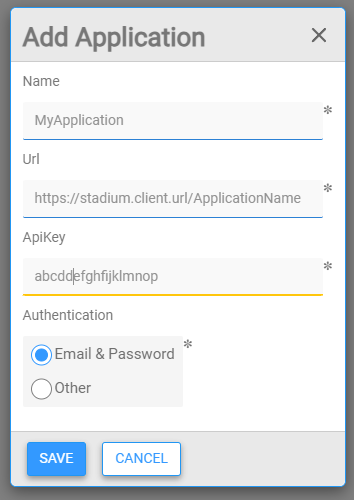
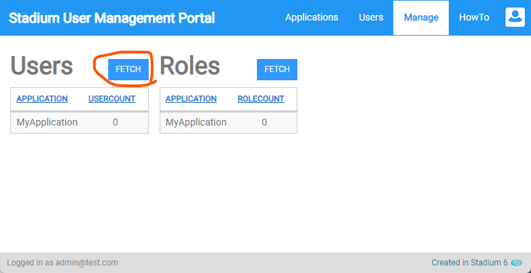
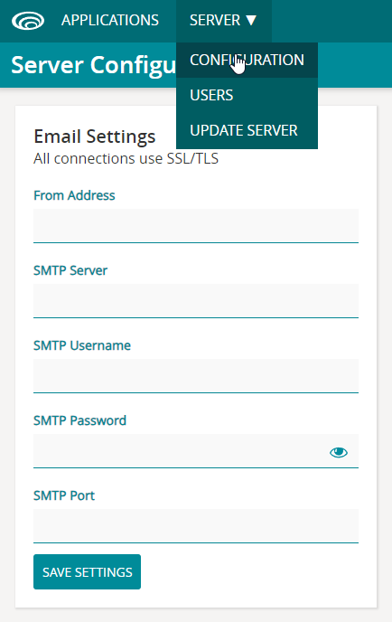
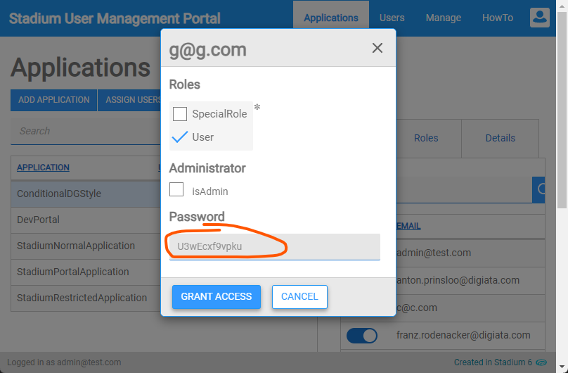

# User Management Portal <!-- omit in toc -->

This application serves three main purposes:

1. Facilitate the management of users across multiple Stadium applications
2. Enable the bulk management of users
3. Provide users with a dashboard containing all their Stadium applications

## TOC <!-- omit in toc -->

- [Version](#version)
- [Portal Setup](#portal-setup)
- [Adding Applications](#adding-applications)
- [Authentication Methods](#authentication-methods)
- [Known Issues](#known-issues)

## Version 
1.0 - initial

## Portal Setup

1. Clone this repo
2. Create the SQL Server Database
   1. Add a database called "StadiumPortal"
   2. Run the script in the /database directory of this repo to create the database tables
3. Preview the application
   1. Open the application in a Stadium Designer v6.9.3 or higher
   2. Open 'Settings' in the Application Explorer and enter a connection string to the Database
   3. Select 'Preview'
4. Publish the application
   1. Upload the application in the /Stadium6 folder to your Stadium Application Manager (SAM)
   2. Configure the connection info to the "StadiumPortal" database
   3. Configure other application details
5. Access the Portal application
   1. Open the "Users & Roles" module
   2. Create a Role called "PortalAdmin"
   3. Assign all application pages to the role
   4. Assign the "PortalAdmin" role to the admin user

## Adding Applications

1. Stadium Application Manager (SAM)
   1. Open the application you wish to add to the portal
   2. Go to the "User API" section
   3. Generate an API key

2. Portal
   1. Open the "Applications" page
   2. Select "Add Application"
   3. Give the application a name
   4. Add the base URL of the application (excluding the page name) to the Url field (e.g https://stadium.server.url/StadiumAppName/)
   4. Copy the API key generated in SAM to the "ApiKey" field
   5. Select the Authentication method of the application (more on [authentication methods](#application-authentication-methods))

3. Users
   1. Open the "Manage" page of the application
   2. Select the "Fetch" button above the "Users" DataGrid to retrieve the application users and roles
   3. NOTE: At present only roles assigned to users can be fetched using the "User API", so make sure all roles are assigned to at least one user

## Authentication Methods

**Email & Password**

When assigning users to Stadium applications in the Portal, an initial password is generated for each user. However, for security reasons, the Portal database does not store these passwords and they cannot be fetched using the User API. These are downloaded after generation and can be manually sent to the respective users. 

For applications that are configured to use "Email & Password" authentication, it is advisable to configure the "Email Settings" in the "Server -> Configuration" section of SAM. This will allow users to define their own passwords using the "Forgot Password" facility. 

Alternatively, when users are added in the Portal, the initial password can manually be sent to the respective users. 

**Single Sign-on (SSO)**

If your application access is controlled via an SSO server, it is advisable to also set up the Portal on the SSO server.  

## Known Issues
None as yet